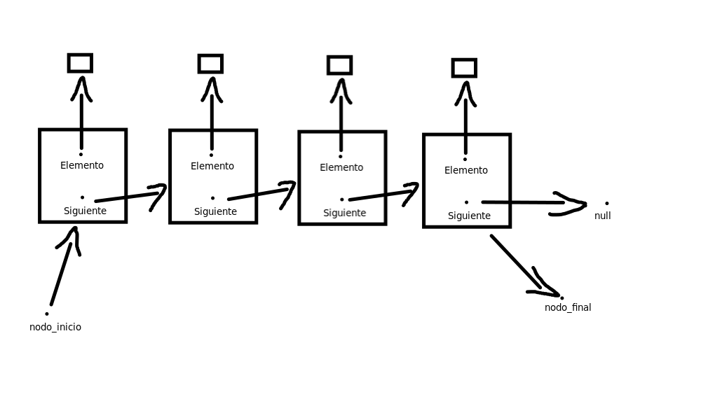
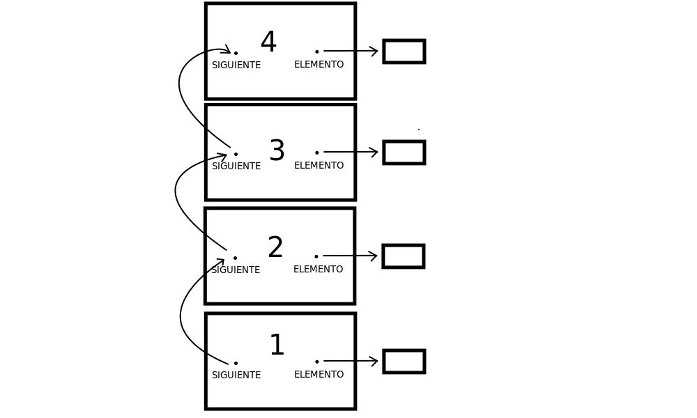
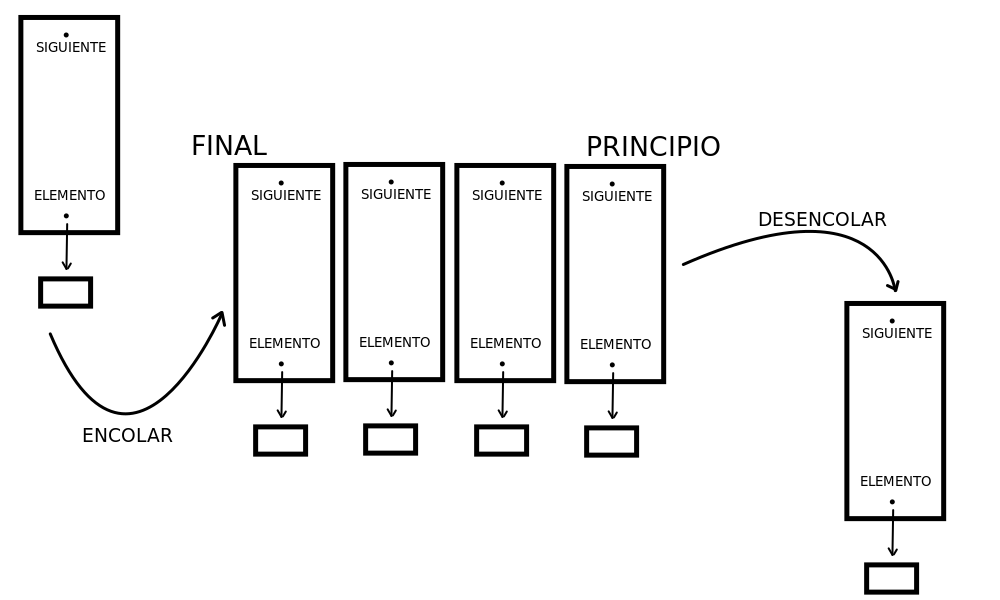

<div align="right">

</div>

# NOMBRE TP/TDA

## Repositorio de Sebastián Loe - 110106 - sloe@fi.uba.ar

- Para compilar:

```bash
gcc -std=c99 -Wall -Wconversion -Wtype-limits -pedantic -Werror -O2 -g src/*c -o pruebas_alumno
```

- Para ejecutar:

```bash
make
```

- Para ejecutar con valgrind:
```bash
make
```
---
##  Funcionamiento

Este trabajo apunta a trabajar con el Tipo de Dato Abstracto (TDA) llamado lista. También trabaja con dos "formas" extra de plantear una lista, como pila y cola (se explica qué es cada cosa en los puntos teóricos). El trabajo se compone de tres archivos principales. El más importante de estos es 'lista.c', mientras que 'cola.c' y 'pila.c', si bien funcionan similarmente, reutilizan el código hecho en 'lista.c'.

Explicando en detalle 'lista.c', este contiene las funciones dadas en 'lista.h':

- lista_crear: crea una lista reservando memoria y devuelve un puntero a esa lista.

- lista_insertar: tomando la lista y un elemento pasados por parámetro, la función inserta, después del nodo_final (si ya había otros nodos), un nuevo nodo con el elemento pasado por parámetro, y hace de ese nodo su nuevo nodo_final. En el caso de que no hubiera nodos en la lista, toma este nuevo nodo como su inicial y su final al mismo tiempo. Luego devuelve la lista.

- lista_insertar_en_posición: tomando la lista, un elemento, y una posición pasados por parámetro, la función intenta insertar en la posición dada el nuevo nodo. Hay 3 posibles casos para la inserción del nuevo nodo. El primero de estos es que la posición dada sea mayor o igual a la cantidad de nodos de la lista. En este caso, el nuevo nodo se inserta al final de la lista mediante la función lista_insertar. El segundo caso se da si la posición es 0, en donde se chequea si hay otros nodos en la lista. De no haber, se llama a la función lista_insertar para insertar el nodo al final de la lista. Si no, se copia el nodo inicial en el nodo siguiente al nuevo nodo, y luego se reemplaza el antiguo nodo inicial por el nuevo nodo. El último de los casos se da en cualquier otra posición de la lista, en donde se recorre la lista guardando tanto el nodo que se está recorriendo y el anterior a ese. Una vez llegado a la posición solicitada, se copia el nodo de esa posición a la siguiente del nuevo nodo, y luego se copia este nuevo nodo en la siguiente posición del nodo anterior. Luego, esta función devuelve la lista.

- lista_quitar: también ofrece dos posibilidades. Tomando la lista por parámetro, si la cantidad de nodos es 1, se libera el único nodo de la lista y luego se establece la lista como vacía. Si la cantidad no es 1 ni 0 (si es 0 no puede correrse la función), se recorre la lista hasta la anteúltima posición, y se establece esa posición como la última, y se libera la siguiente. Esta función devuelve el elemento del nodo quitado.

- lista_quitar_de_posicion: similar a insertar_en_posicion, se fija en un primer caso si la posición pasada por parámetro es 0. Si lo es y no hay solo un nodo en la lista, se elimina el primer nodo y se hace de su siguiente el nuevo nodo de inicio. En el caso de que haya solo un elemento, se llama a lista_quitar. Luego, si la posición es menor a la cantidad total de nodos, se recorre la lista hasta la posición indicada y se guardan tanto el nodo de la posición actual, su anterior, y el elemento del nodo actual. Llegada a la posición, se unen el siguiente del nodo anterior con el siguiente del nodo actual, y se elimina el actual. Si no, si la posición ingresada es mayor o igual a la cantidad de nodos, la función elimina el último nodo, y para eso se llama a lista_quitar. Esta función devuelve el elemento del nodo quitado.

- lista_elemento_en_posicion: siendo la posición pasada una existente de la lista, la función recorre la lista hasta la posición indicada y devuelve el elemento del nodo de esa posición.

- lista_buscar_elemento: dado un comparador que compara dos elementos, la función recorre la lista comparando el elemento del nodo actual con el elemento dado, y si son iguales, devuelve el elemento del nodo de la posición que está comparando. Si no encuentra un elemento igual, la función devuelve NULL.

- lista_primero: devuelve el elemento del primer nodo de la lista.

- lista_ultimo: devuelve el elemento del último nodo de la lista.

- lista_vacía: devuelve true si y solo si la lista es NULL o si no tiene elementos. 

- lista_tamanio: devuelve lista->cantidad.

- lista_destruir: recorre la lista y libera nodo por nodo. Luego libera la lista.

- lista_destruir_todo: igual que lista_destruir, pero le aplica una función a cada nodo. 

- lista_iterador_crear: crea un iterador reservando memoria. Para eso, asigna lista->nodo_inicio a iterador->nodo_actual. La función devuelve un puntero al iterador.

- lista_iterador_tiene_siguiente: devuelve true si tanto el iterador como su elemento actual existen.

- lista_iterador_avanzar: avanza al iterador al siguiente nodo y devuelve true si pudo avanzar correctamente.

- lista_iterador_elemento_actual: devuelve el elemento del nodo actual del iterador.

- lista_iterador_destruir: destruye el iterador liberándolo.

- lista_con_cada_elemento: recorre la lista y aplica una función a los elementos de los nodos. Si la función devuelve false, o si la iteración llega a su fin, se devuelve la cantidad de elementos recorridos.


        - 'cola.c' y 'pila.c' tienen funciones muy similares y reutiliza funciones de 'lista.c'. Puesto que su funcionamiento responde a una de las preguntas teóricas, no se explicará en esta parte.

---

## Respuestas a las preguntas teóricas

- ¿Qué es una lista/pila/cola? Explicar con diagramas.

En este trabajo se implementa una lista de nodos enlazados. Esta es una estructura de datos que almacena elementos de manera secuencial. Cada uno de estos nodos contiene un elemento y una referencia al siguiente nodo de la lista, todos conectados entre sí. Distinto a un vector, para acceder a una posición dentro de la lista, es necesario recorrer la lista nodo por nodo hasta llegar a su posición. 

Las pilas son similares a las listas en el sentido de que también almacenan sus elementos secuencialmente. La diferencia es que en las pilas, si bien se puede acceder a la información de cada nodo en cualquier momento, solo pueden insertarse y eliminarse elementos en su tope/parte de arriba. 

De la misma manera funcionan las colas, aunque en este caso los elementos nuevos se insertan al final de la cola, y se quitan desde el frente o posición 0.

Lista:

<div align="center">

</div>


Pila:


<div align="center">

</div>


Cola:


<div align="center">

</div>


- Explica y analiza las diferencias de complejidad entre las implementaciones de lista simplemente enlazada, doblemente enlazada y vector dinámico para las operaciones:
   - Insertar/obtener/eliminar al inicio
        Lista simplemente enlazada: se requiere actualizar el puntero del primer nodo, por lo que tiene una complejidad de O(1)
        
        Lista doblemente enlazada: para este caso, como también se requiere actualizar el puntero del primer nodo para la inserción, o la del segundo para la eliminación, por lo que su complejidad es de O(1)

        Vector dinámico: la inserción o eliminación de un elemento requiere que se desplacen todos los elementos hacia un lado, por lo que tiene una complejidad de O(n). 


   - Insertar/obtener/eliminar al final
        Lista simplemente enlazada: para insertar al final se puede acceder directamente a la última posición e insertar el elemento y actualizar el nodo, con lo cual la complejidad es O(1). Pero para eliminar y obtener es necesario recorrer toda la lista, por lo que la complejidad es O(n).

        Lista doblemente enlazada: la inserción, la obtención y la eliminación al final tienen una complejidad de O(1) ya que es posible acceder a la última posición y su anterior directamente y actualizar los nodos.

        Vector dinámico: al igual que la lista doblmente enlazada, se puede acceder directamente a la última posición del vector y actualizar los elementos, por lo que tiene una complejidad de O(1)


   - Insertar/obtener/eliminar al medio
        Lista simplemente enlazada: requiere recorrer la lista hasta llegar a la posición pedida para hacer cualquiera de las tres tareas, entonces tiene complejidad O(n).

        Lista doblemente enlazada: también es necesario recorrer la lista entonces es de complejidad O(n).

        Vector dinámico: La inserción y eliminación requieren desplazar todos los elementos hacia un lado por lo que tiene una complejidad de O(n) también.


- Explica la complejidad de las operaciones implementadas en tu trabajo para la pila y la cola.

Pila:
    - pila_crear:
        tiene complejidad de O(1) puesto que solo crea la lista y designa memoria para ello.

    - pila_apilar:
        tiene complejidad de O(1) puesto que inserta un elemento en el tope de la pila y solo se necesita actualizar el puntero del primer elemento.

    - pila_desapilar:
        desapila desde el tope, y solo se necesita actualizar el puntero del primer olomento por lo que es O(1).

    - pila_tope:
        devuelve el elemento del primer nodo de la pila, por lo que no es necesario recorrer, y su complejidad es O(1).

    - pila_tamanio:
        devuelve la cantidad de nodos que ya estaba siendo registrado en el struct. Por lo cual es solo buscar esa información, y su complejidad es O(1).

    - pila_vacia:
        chequea si la pila existe o si la cantidad de nodos es distinta de 0, por lo que su complejidad es O(1).

    - pila_destruir:
        como se debe liberar la memoria de cada nodo, y se debe recorrer la lista, la complejidad es de O(n).

Cola:
    - cola_crear:
        mismo caso que pila, la complejidad es O(1).

    - cola_encolar: 
        inserta un elemento al final de la cola y puede accederse directamente a ese elemento, por lo que la complejidad es O(1).

    - cola_desencolar:
        mismo caso que desapilar, pero la palabra técnica para posición 0 es 'frente', la complejidad es O(1).

    - cola_frente:
        mismo caso que pila_tope. La complejidad es O(1).

    - cola_tamanio:
        mismo caso que pila_tamanio. Su complejidad es O(1).
    
    - cola_vacia: 
        mismo caso que pila_vacia. Su complejidad es O(1).
    
    - cola_destruir:
        mismo caso que pila_destruir. Su complejidad es O(n).
